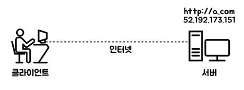
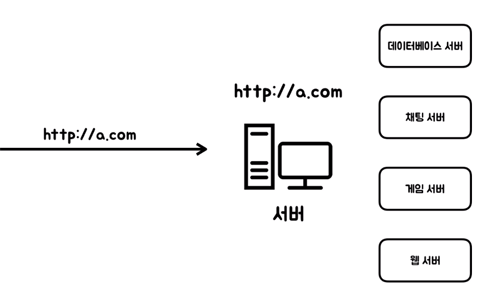
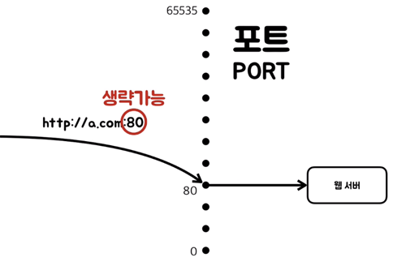

### 인터넷, 도메인네임, IP, PORT

## 인터넷의 동작방법
  
### 인터넷의 의의
- 컴퓨터는 독립적인 존재였는데 인터넷을 통해 서로가 연결되어 협력적인 처리를 할 수 있게된다.

### 클라이언트와 서버
- 클라이언트 : 고객 (갑) 웹브라우저가 설치된 컴퓨터 - 클라이언트
- 서버 : 고객의 요청을 제공, 응답 (을) 서버가 설치되어있는 컴퓨터 - 서버

### 도메인네임과 IP
- 도메인네임 : 사람이 기억하기 쉽도록 만들어진 이름
- IP : 구체적인 주소 (IP주소, IP어드레스)
- 사용자는 도메인을 이용해 접속하지만 실제로는 도메인과 일치하는 IP를 통해서 접속하는 것

 
- 서버는 다양한 서버를 가지고 있을수 있는데 그 중 어떤 서버를 사용자에게 제공할 것인가를 결정함

## PORT
- PORT : 0~65535 개의 문
- 리스닝 : 웹서버를 실행시킬때 하나의 포트에 연결해 듣고있는 것 

  

- 만약 사용자가 http\://a.com:80에 접속요청을 하면 서버 컴퓨터는 a.com에 해당되는 서버를 가져와 80번 포트와 연결해줌 여기에서 웹브라우저를 통해 들어온 접속은 웹서버를 리스닝하고있는 80번 포트가 웹서버를 호출해서 웹서버가 응답할 수 있게됨

- 서버 컴퓨터는 http:// 로 인해서 웹브라우저를 통해 접속했다는것을 알 수 있기때문에 웹서버를 리스닝하는 80포트에 연결해줄 수 있기 때문에 포트는 생략이 가능함 http\://를 통해서 접속한경우에는 80번 포트를 쓰자고 약속한 것과 같음

- 만일 1337 포트에 웹서버를 연결하면 1337번 포트로 컴퓨터를 연결 해주게됨
