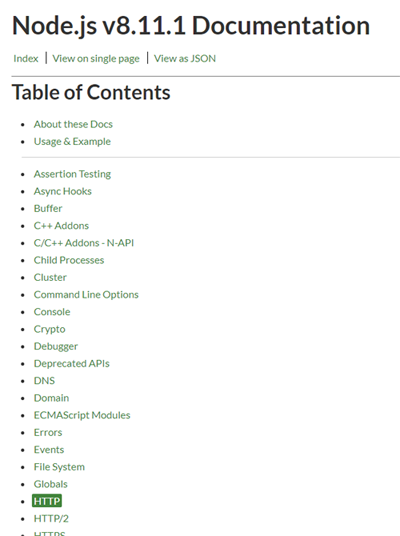
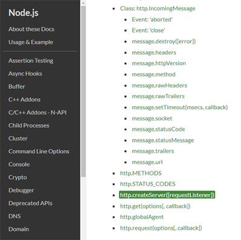
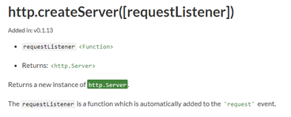
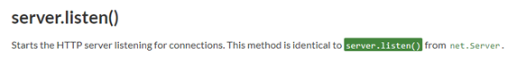

## 모듈
- 모델, 부품

## 코드해석과 모듈 사용설명서
- 모듈 사용설명서
  - [nodejs](https://nodejs.org/en/) 홈페이지 - DOCS(문서) 메뉴 - 해당 버전선택 - 모듈선택 - 메소드선택 - 사용법보기
```
const http = require('http');
```
> require 아래의 코드가 동작하기위해 nodejs에서 제공하는 http라는 모듈이 필요, 요구된다.<br/>require가 실행되면 http 이름을 가진 부품을 가져와 로드해서 사용할 수 있또록 하고 그 리턴값을 상수 http에 담는다.<br/>즉, 상수 http에 모듈 http를 담아 상수를 통해 모듈을 제어할 수 있다.

- const : 상수 즉, 변수와 같이 값을 담는 역할을 하지만 한번 할당되면 할당된 값을 변경할 수 없음

```
http.createServer((req, res) => {
  res.statusCode = 200;
  res.setHeader('Content-Type', 'text/plain');
  res.end('Hello World\n');
}).server.listen(port, hostname, () => {
  console.log(`Server running at http://${hostname}:${port}/`);
});
```
<br/>
> http 모듈선택

<br/>
> createServer 메소드선택<br/>http 모듈은 createServer메소드를 가진다.

<br/>
> Returns a new instance of http.Server. : http 모듈에 속해있는 Sever라는 객체를 리턴한다. 

<br/>
> Server는 listen 메소드를 가진다.

- 즉, http 모듈에 createServe((){}) 메소드를 호출하면 이것은 http에 속한 server 객체를 리턴하는데 이 객체는 listen 이라는 메소드를 가지고있기때문에 코드를 호출할 수 있다.
- `require() : 인자에 온 모듈을 리턴`
- 결국, 모듈은 부품이고 부품을 가져다쓸때는 require라는 함수를 가져다쓴다.<br/>에플리케이션을 만들기위해 nodejs는 부품들을 기본적으로 제공한다. (http 등)<br/>그 부품을 어떻게 사용하는지 모듈 사용설명서를 읽을줄 알아야한다.


### 다른 모듈 사용해보기
- OS 모듈의 os.platform() : 현재 시스템이 어떤 운영체제인지를 리턴해줌
  - OS(Operating System) : 운영체제
  
<br/>- module.js
```
var o = require('os');
console.log(o.platform());
```
> require('os')로 os 모듈을 리턴해서 console.log로 해당 운영체제의 정보를 리턴함
- 결과
```
win32
```
> 터미널에서 node module.js 로 출력확인
