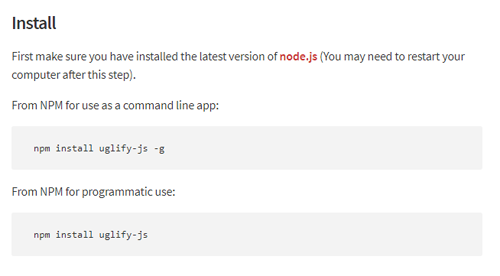

## NPM 독립적인 앱 설치
- NPM을 이용해 nodejs로 만든 소프트웨어 사용하기
- NPM을 이용해 패키지를 글로벌리하게 독립적인 소프트웨어를 설치 해보기 (Ugliyfy 이용)

## Uglify-js
- 소스코드를 못생기게 만들어줌
- 프로그램이 사용할때 필요한 필수적인 코드를 제외한 공백등고 같은것들이 제거됨<br/>즉, 코드에 가독성을 위한 줄바꿈, 공백 등이 사라져 출력됨

### 설치방법
- [Npm](https://www.npmjs.com/) 홈페이지 검색창에서 uglify-js 검색해서 설치방법 확인

<br/><br/>
- `-g : (global) 자신의 컴퓨터 전역에서 사용되는 독립적인 소프트웨어로 사용한다.`<br/>npm init을 하든말든 해당 프로젝트를 신경쓰지 않겠다는 의미의 설치로 npm init을 사용하지 않고도 설치가 가능하며, 어느곳에서든 실행이 가능해진다.
- `X : (local) 현재 npm을 설치하고있는 프로그램안에서만 부품으로 사용한다.`
```
npm install uglify-js -g
```
- permission error가 나면 맨 앞에 sudo를 붙여 설치할 것

> 터미널에서 설치
- `--help : 사용법보기 (ex. uglifyjs --help)`


### 사용하기
- pretty.js
```
function hello(name){
  console.log('Hi,'+name);
};
hello('egoing');
```
- 실행1
```
uglifyjs pretty.js
```
- 결과
```
function hello(name){console.log('Hi,'+name);};hello('egoing');
```
- 실행2
```
uglifyjs pretty.js -m
```
> mangle의 의미로 짓이긴다는 뜻<br/>지역변수와 같이 이름을 변경 가능한것들을 한글자의 짧은 코드로 변경해준다.
- 결과
```
function hello(o){console.log('Hi,'+o);};hello('egoing');
```

### 파일로 저장
```
uglifyjs pretty.js -o pretty.min.js -m
```
> uglified 시킨 코드를 pretty.min.js 파일로 저장한다.
- min : mini 파일로, 파일이 최소화(어글리파이드)된 것을 의미함
