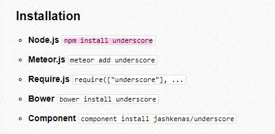

## npm으로 모듈 설치하기

### underscore.js 모듈 설치해보기

1. 초기화 (npm init)
- 모듈 설치전에 반드시 해주어야함
- 자신의 소프트웨어(프로젝트)를 패키지로 지정하기위한 환경설정
- 타인의 패키지를 가져오려면 자신의 프로젝트 디렉토리 자체를 npm의 일종의 패키지로 지정하는 명령을 해주어야 함
```
npm init
```
```
name : 프로젝트명 (괄호안에 값이 자동으로 지정 정의하려면 엔터)
description : 프로젝트 설명
entry point : 어떤 자바스크립트가 이 패키지를 구동시킬것인가 (수정가능)
test command : 패키지에서 tdd를 하게되면 어떤명령을 실행해 테스트를 실행시킬 수 있는가 (생략가능)
git repository : git에 올라갈경우의 주소 (생략가능)
```
> 마지막에 yes 치고 엔터치면 완료

- 이 과정을 마치면 package.json 파일이 생성됨
> npm init에 적은 정보를 파일로 만들어줌

- npm 패키지의 디렉토리로 설정하고, 이 패키지에 대한 정보를 기록했다.<br/>해당 프로젝트를 npm 홈페이지에 등록해 다른사람들도 자신의 프로젝트를 npm을 통해 설치할 수 있게 만드는 초석이 된다.<br/>이것으로 이제 다른사람이 만든걸 내 프로젝트에 포함시킬 수 있게되었다.


2. 설치
- [npm](https://www.npmjs.com) 홈페이지 검색창에 underscore 검색
- [underscorejs](http://underscorejs.org) 홈페이지로 연결
- 설치방법 참고하여 설치하기
<br/><br/>
- node_modules 디렉토리가 생성되고 그 안에 underscore 디렉토리와 그 안에 모듈이 위치하게 됨
> 해당 설치작업을 npm이 대행해준 셈

### --save
- 플래그, 옵션을 의미
- 모듈을 온전하게 설치하는 방법
- 단순히 npm install underscore 하게되면 extraneous 가 출력됨
  - extraneous : 모듈이 온전하게 포함되지 않은 상태
```
npm install underscore --save
```
- 결과
```
"dependencies": {
  "underscore": "^1.9.0"
}
```
> package.json 에 해당 코드가 추가됨<br/>해당 패키지는 underscore의 1.9.0 버전에 의존하고있음을 표시해줌

#### dependencies(의존성)의 유무
- O : 새로운 프로젝트에 package.json 파일만 있으면 언제든지 underscore의 1.9.0 버전을 자신의 프로젝트에 포함시킬 수 있음<br/>새로운 폴더에 다시 프로젝트를 시작한다하더라도 dependencies에 포함된 모듈을 쉽게 가져올 수 있음
- X : 쉽게 가져올 수 없음

> 소스코드에 포함시키지않고 필요에의해 일시적으로 사용할때는 --save를 빼고, 프로젝트에 이 모듈이 반드시 필요하고 언제나 따라다녀야한다면 --save를 붙여서 설치한다.

> 즉, 어떠한 모듈을 우리의 프로젝트에 포함시킬때는 반드시 --save를 써라.
