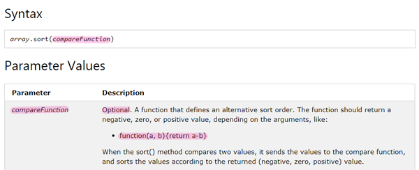

## Callback Function
- 인자의 값으로 전달 된 함수
- 콜백 함수는 내부적으로 필요할때마다 호출이 됨
  - 사용자가 호출하는것이 아닌, 누군가에게 호출당할 함수
- 함수의 기본적인 기능을 확장시킴
```
a = [3, 1, 2]; a.sort(); console.log(a);
```
- 결과
```
[3, 2, 1]
```
> 터미널에서 node 를 입력하면 개발자 도구의 console 창의 기능과 같은기능을 해주고, 세미콜론(;)을 통해서 여러개의 코드를 나열할 수 있음

#### sort 기능 확장
- [javascript sort array](https://www.w3schools.com/jsref/jsref_sort.asp) 검색해서 사용법보기

;
> sort 함수의 기능을 확장해 반대로 정렬시키려면 매개변수에 함수를 부여해라

- `optinal(옵션) : 생략가능`

```
a = [3, 1, 2]; function b(v1, v2){return v2-v1}; a.sort(b); console.log(a);
```
- 결과
```
[3, 2, 1]
```
- 익명함수를 sort에 콜백함수로 적용
```
a = [3, 1, 2]; a.sort(function(v1, v2){return v2-v1}); console.log(a);
```
> 코드가 짧아짐

- `익명함수 : 이름이 없는 1회성 함수`<br/>함수에 이름을 주는이뉴는 나중에 여러번 호출할필요가 있기때문이다. 그런데 1회성으로 사용한다면 이름을 줄 필요가 없이 인자에 바로 함수를 주면된다.

- 코드 이해하기
```
function sort(callback){callback();};

sort(function(v1, v2){return v2-v1});
```
> sort 함수는 매개변수로 콜백함수를 받고 내부적으로 그 콜백함수를 실행시킨다.<br/>sort함수는 매개변수가 있기때문에 실행할때 인자를 받고 그 인자에 익명함수가 들어갔다.
