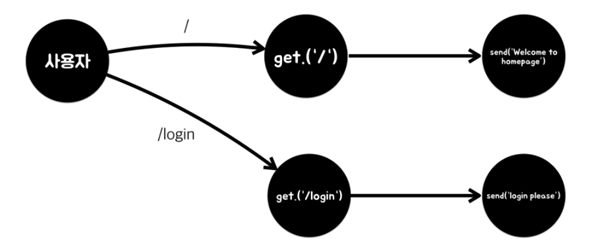

### Express

## 메뉴얼
- 메뉴얼을 통해 문제를 해결하고 Express에 대해서 익힘
- 홈페이지 - 시작하기 메뉴 - [Hello World 예제](http://expressjs.com/ko/starter/hello-world.html)
- [라우팅](http://expressjs.com/ko/guide/routing.html) 참고


## 간단한 웹앱(Hello World) 만들기
app.js
```
var express = require('express');
var app = express();

app.get('/', function(req, res){
  res.send('Hello home page');
});
app.get('/login', function(req, res){
  res.send('<h1>Login please</h1>');
});
app.listen(3000, function(){
  console.log('Conneted 3000 port!');
});
```
> 프로젝트의 규모가 크다면 여러개의 파일로 앱을 만들게되는데 그 중 어느것을 실행해야 앱을 실행시킬 수 있는지를 정의해야 함<br/>그 최초의 에플리케이션 즉, 진입점(메인 에플리케이션)의 파일명을 관습적으로 app.js로 많이 사용함 (수정가능)

#### 코드분석
```
var express = require('express');
```
> express 패키지 include
```
var app = express();
```
> 약속된 코드<br/>express 모듈을 통해서 에플리케이션 객체를 만들어줌

> 모듈은 함수라서 함수를 실행하면 그 함수는 에플리케이션을 리턴하고 그 리턴값을 변수에담아 에플리케이션을 제어함
```
app.listen(3000, function(){
  console.log('Conneted 3000 port!');
});
```
> port를 지정하고 접속에 성공하면 콜백함수를 리턴함

> 여기에서 접속하면 파일이 없기때문에 Cannot GET / 으로 error page가 출력됨

```
app.get('/', function(req, res){
  res.send('Hello home page');
});
```
> get 방식으로 접속한 사용자중에 홈(/)으로 접속한 사용자에게 send의 인자값으로 응답

> 사용자가 해당 루트로 들어왔을때 함수를 실행시키면서 사용자가 요청한 정보를 첫번째 매개변수의 값으로 전달하고, 사용자가 요청한 정보에 대한 응답을 할 수 있는 방법을 담고있는 응답에 대한 객체를 두번째 인자에 전달해줌<br/>이 응답에대한 형식은 콜백함수로 정의함

- get \/ post : 사용자가 웹서버에 접속할때의 두가지 방식<br/>일반적으로 url에 직접치고 접속하는것이 get방식
- send() 와 같은 res의 메소드는 메뉴얼에서 참고

- 실행
```
node app.js
```
- 접속
```
localhost:3000
```
- 결과
```
Hello home page
```
- 루트설정
```
app.get('/login', function(req, res){
  res.send('<h1>Login please</h1>');
});
```
> login 페이지로 접속한 사용자에게 응답
- 실행
```
node app.js
```
> 두번째 실행을 위해서는 처음 실행했던 서버를 한번 끊어주고(ctrl+c) 다시 연결해야 수정된 코드가 반영됨
- 접속
```
localhost:3000/login
```
- 결과
```
Login please
```


## 라우터 (Router)
- get 메소드를 일컫는 말로, get 메소드가 하는 일은 라우팅이라고 함
- 사용자가 어떤 경로로 들어왔을때 어떤것이 실행될것인지를 결정, 연결해주는 역할
> router는 길을 찾는다는 의미로 요청이 들어왔을때 요청이 길을 찾을 수 있도록 연결해주는 것이라고 이해

<br/>
> 사용자의 요청과 요청에대한 처리(controller)를 중계(router)해줌
- 사용자 : 웹브라우저를 통해 우리의 앱으로 접속하는 대상
- 앱 : 라우터, 컨트롤러로 이루어짐

<br/><br/>

- Router는 가장 중요한 것 중에 한 부분이므로 위에 코드를 무조건 숙지해야함
