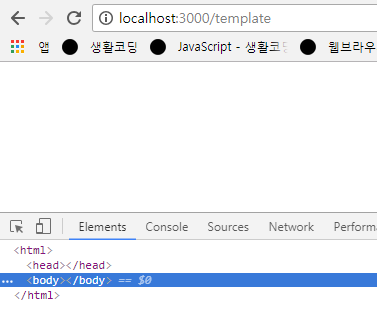

## 템플릿 엔진
- 웹사이트를 작성할때의 정적인 표현과 동적인 표현의 장점을 결합한 것
  - html 코드에 프로그래밍적 코드를 삽입하거나 변수도 사용할 수 있음
- 정해진 특수한 방법으로 웹페이지를 작성하는 것
- 독립적으로 다른곳에서도 사용함
- 여러가지의 템플릿엔진이 존재 (Pug(jade), Handlbar, EJS, Twig, Swig ...)


## 템플릿 엔진 사용
- [Express 템플릿엔진 사용법](http://expressjs.com/ko/guide/using-template-engines.html) 참고
1. 설치
```
npm install pug --save
```
> 템플릿엔진 중 하나인 pug를 설치함

2. 선언
```
app.set('view engine', 'pug');
```
> 사용할 템플릿엔진을 express에게 알려줌

3. 디렉토리 설정
```
app.set('views', './views');
```
> 디렉토리를 하나 선택하고 그 디렉토리의 경로를 지정해주고 그 폴더안에 템플릿엔진 파일들을 저장<br/>관습적으로 디렉토리명은 views를 많이 사용<br/>이 코드는 생략가능함 생략을 해도 알아서 views 폴더를 찾아서 인식함

4. 코드작성
temp.pug
```
html
```
> 템플릿 문법에 맞게 코드를 작성하고 views 디렉토리 안에 저장

5. 랜더링
- 소스코드를 가져와서 웹페이지를 만들어내는 행위
```
app.get('/template', function(req, res){
	res.render('temp');
})
```
> template 경로를 통해 들어온 사용자에게 temp 파일 즉, 템플릿파일을 웹페이지로 랜더링한 결과를 전송함

- 실행
```
supervisor app.js
```
- `supervisor *.js : 코드가 수정되면 자동으로 서버를 재가동시킴`

- 접속
```
localhost:3000/template
```

- 결과

<br/>

- temp를 랜더하게되면 express는 내부적으로 템플릿엔진으로 pug를 지정해놨기때문에 views에 해당되는 ./views 디렉토리에서 temp.pug를 찾아 그 파일을 pug문법에 따라 해석한뒤 결과를 가져와서 사용자에게 응답해준다.
