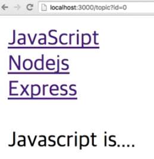

## URL을 이용한 정보전달
- 지금까지의 우리 앱은 여러가지의 패스를 제공하고 패스마다 서로 다른 아웃풋을 제공하고 있음
- 패스마다 다른 결과를 갖고있지만 결국, 하나의 패스는 하나의 결과를 가지고있음
  - 즉, a.com/topic은 언제나 같은 출력형태를 가지고있음 (현재까지는)
- 앱은 언제나 똑같이 동작하지만 사용자의 입력, 조작에따라 적당한 다른 결과를 갖는것이 좋은 앱
- `/* : path`


## 쿼리스트링 (Query String)
- `?*`
- 같은 패스여도 경우에따라 다른 결과를 가지고있는 것
```
http://a.com/topic?id=1
```
> 하나의 패스(라우터)에 어떤 아이디값을 주느냐에따라 다른 결과를 만들어낼 수 있음

- http (HyperText Transfer Protocol) : 프로토콜 \/ 웹페이지를 요청하고 받아내기위한 목적으로 고안된 통신규약
- a.com : 도메인 \/ 서버컴퓨터가 위치한 주소를 나타냄
- /topic : 패스 \/ 웹서버를 직접 설정했다면 지정한 디렉토리가 이에 해당함, 직접설정 방식이 아닌경우에는 라우터랑 연결된 대상이 됨
- ?id=1 : 쿼리스트링
> 이 모든것을 합치면 URL이 됨

- 이전에는 패스값에 따라 출력값이 달라졌다면, 쿼리스트링이 바뀜에따라 하나의 패스가 다르게 동작하는 웹페이지를 만들수 있다.


## Express의 query객체의 사용
- 사용자가 해당 패스로 접속하면 express가 익명함수를 호출하면서 첫번째 인자의 값으로 request 객체를 전달하고, 두번째 인자의 값으로 response 객체를 전달하겠다라는 것이 약속되어있음
- 각 객체들의 프로퍼티는 [Express API](http://expressjs.com/ko/4x/api.html) 를 참고

### res.query
- request는 사용자의 query스트링을 프로퍼티로 갖으며 위 코드는 해당 쿼리스트링의 값을 가져옴
```
app.get('/topic', function(req, res){
  res.send(req.query.id);
  res.send(req.query.name);
});
```
> localhost:3000/topic?id=1 접속하면 웹페이지에 id값인 '1'이 출력됨<br/>localhost:3000/topic?name=egoing 접속하면 웹페이지에 name값인 'egoing'이 출력됨

- 복수의 값
```
res.send(req.query.id+','+req.query.name);
```
> localhost:3000/topic?id=1&name=egoing 접속하면 웹페이지에 '1,egoing'이 출력됨
- 쿼리스트링을 통해서 앱에게 전달할 수 있는 값은 여러개일 수 있으며, 값과 값을 구분하는 구분자로 &(andpersand)를 쓴다.


## query 객체의 활용
```
app.get('/topic', function(req, res){
  var topics = [
    'Javascript is....',
    'Nodejs is...',
    'Express is...'
  ];
  res.send(topics[req.query.id]);
});
```
> 사용자가 id값으로 값(0~2)을 넣게되면 해당 index의 값을 가져와 출력함
```
var output = `
  <a href="/topic?id=0">JavaScript</a><br>
  <a href="/topic?id=1">Nodejs</a><br>
  <a href="/topic?id=2">Express</a><br>
  ${topics[req.query.id]}
`
res.send(output);
```
- 결과


> 각각의 a 태그를 클릭 할때마다 해당 id값의 url로 접속해 해당하는 정보를 아래에 출력함

- 쿼리스트링은 앱에게 정보를 전달하는 url에 약속된 국제적인 표준이다. 쿼리스트링으로 전달된값은 req 영역이므로 req 객체의 query 객체가 가진 id 값을 통해 원하는 출력형태를 가져올 수 있다.


## 시멘틱(semantic) URL
- 쿼리스트링없이 깔끔한 url을 통해 웹앱을 제어하는 체계
- 쿼리스트링 방식을 패스방식으로 바꾼 것
- [semantic URL](https://en.wikipedia.org/wiki/Clean_URL) 참고
```
http://example.com/index.php?pages=name  // 쿼리스트링
http://example.com/name  // 시멘틱URL
```
### 방법
- url의 패스형식을 라우터에 걸어줘야함
- `:* : 가변적인 정보를 잡아주고 요청하는 *값을 받아냄`
```
localhost:3000/topic/1
```
- 결과
```
Cannot GET /topic/1
```
> 라우터에 해당 루트를 연결해주지 않고 그냥 실행했을 경우 페이지를 찾을 수 없음
```
app.get('/topic/:id', function(req, res){
...
})
```
> 콜론으로 정보를 잡아준 경우 페이지를 출력하지는 못하지만 Cannot GET 메세지는 뜨지않음
```
app.get('/topic/:id', function(req, res){
  var topics = [
    'Javascript is....',
    'Nodejs is...',
    'Express is...'
  ];
  var output = `
  <a href="/topic?id=0">JavaScript</a><br>
  <a href="/topic?id=1">Nodejs</a><br>
  <a href="/topic?id=2">Express</a><br><br>
  ${topics[req.params.id]}
  `
  res.send(output);
})
```
> query 객체를 parmas로 바꿔주면 쿼리스트링 방식이 패스방식으로 변경됨
- /topic/`:id` 와 req.params.`id`의 id는 서로 연결됨
> 즉, `:*` 의 값은 `.*` 와 서로 연결되어 :\* 의 값이 .* 에 담김
- 복수의 값
```
app.get('/topic/:id/:mode', function(){
  res.send(req.params.id+','+req.params.mode);
});
```
> localhost:3000/topic/1/edit 로 접속했을때 웹페이지에 '1,edit'가 출력됨
