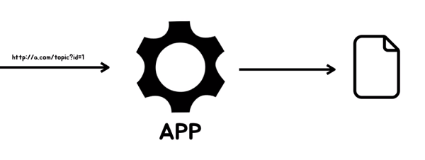
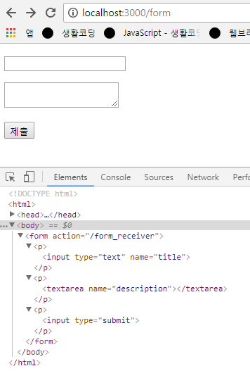
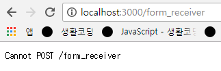
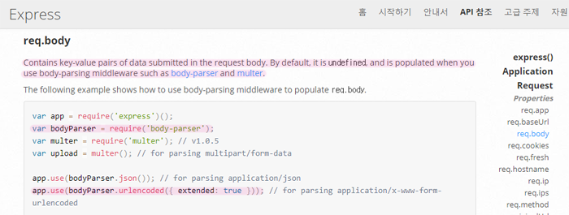
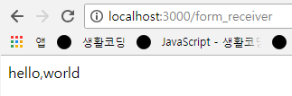

### POST 방식

## GET, POST
- 서버와 웹브라우저가 상호작용하는 방법

### GET 방식

- 웹브라우저에 주소를 입력해서 정보를 가져오는 방식
- 사용자가 서버에게 정보를 요청해 가져오는 것

### POST 방식
- 사용자의 정보를 서버로 전송하는 것
- ID, Password, 작성글 등을 서버로 전송


## 예제를 통해 POST 개념 이해하기
- 전송하고자하는 정보는 form 태그로 묶어 전송함

### GET 방식
form.pug
```
doctype html
html
  head
    meta(charset ='utf-8')
  body
    form(action='/form_receiver')
      p
        input(type='text' name='title')
      p
        textarea(name='description')
      p
        input(type='submit')
```
> views 디렉토리안에 템플릿엔진을 이용해 form 태그를 작성하고, 사용자가 입력한 각 정보의 이름을 알기위해 이름(name)을 부여함

```
form(action='/form_receiver')
```
> submit (제출)버튼을 누르면 정보를 form_receiver 서버로 전송하도록 지정

```
app.get('/form', function(req, res){
	res.render('form');
});
```
> 작성한 form 태그 랜더링



- title 폼에 hello \/ descriptiong 폼에 world 입력 후 제출


> url에 쿼리스트링방식으로 전달됨 (name=값&name=값)
```
app.get('/form_receiver', function(req, res){
	var title = req.query.title;
	var description = req.query.description;
	res.send(title+','+description);
});
```
> 웹페이지에 hello,world 가 출력됨

- form은 url을 생성해주는 작은 프로그램이라고 생각할 수 있음<br/>사용자가 값을 입력하면 웹페이지는 폼태그에따라 적당한 url을 자동으로 생성해 서버로 보내주는 역할을 함<br/>그리고 form_receiver는 사용자가 전달한 title과 description값을 저장할 수 있게됨

### POST 방식
- 사용자가 POST 방식으로 전송한 정보를 서버쪽에서 수신하는 방법
```
form(action='/form_receiver' method='post')
```
> 폼태그에 메소드를 post로 바꾸면 post 방식이 됨 메소드를 생략하면 기본적으로 get방식으로 작동함

- 아까와 같이 각각의 폼에 hello와 world를 입력 후 제출


> 주소에 쿼리스트링이 붙지않고 cannotpost /form_receiver이 출력됨<br/>사용자가 전송한값은 전송이 되었으나 post방식이면 url을 통해서 전송하지않고 우리눈에 보이지않는 방식으로 전달하기때문에 url에 쿼리스트링이 붙지않음

> 어떤 라우터에도 걸리지않음 `app.get('/form_receiver', function(req, res){...})` form_receiver에 걸려있는 방식이 get방식이기 때문
- post 방식으로 변경
```
app.post('/form_receiver', function(req, res){
  res.send('Hello, POST')
});
```
> 웹페이지에 Hello, POST 가 잘 출력됨

```
app.post('/form_receiver', function(req, res){
  var title = req.body.title;
	var description = req.body.description;
	res.send(title+','+description);
});
```
> get 방식은 익명함수가 실행될때 첫번째 인자인 req(request의 객체)의 query객체를 통해 정보를 받았음<br/>post 방식은 query가 아닌 body객체를 이용함
- 결과
```
TypeError: Cannot read property 'title' of undefined
```
> req가 body 객체를 가지고있지 않아서 오류가 뜸

#### req.body 이용
- Express API - Request - [req.body](http://expressjs.com/ko/4x/api.html#req.body) 참고


> 기본적으로 post방식으로 전달된 데이터는 정의되어있지 않기때문에 사용하고싶다면 body-parser 또는 multer 미들웨어를 설치해야함
- body-parser : post 방식으로 전송한 데이터를 우리 앱에서 사용할 수 있도록 해주는 플러그인, 확장기능 모듈
	- [body-parser](https://www.npmjs.com/package/body-parser) 설치방법 참고
	- 이 확장기능 모듈을 우리 앱에 포함시켜 작동하도록하면 body 프로퍼티를 사용할 수 있게됨

1. 설치
```
npm install body-parser --save
```
2. include
```
var bodyParser = require('body-parser');
```
3. 연결
```
app.use(bodyParser.urlencoded({ extended: false }));
```
> body parser 모듈을 우리 에플리케이션에 연결시킴 (use는 모듈을 앱에 붙여준다라고 이해하자)
- 앞으로 이앱으로 들어오는 모든 요청은 body parser 미들웨어가 먼저 동작하면서 라우트가 동작하게 됨

4. 실행
```
http://localhost:3000/form
```
- 폼에 각각 hello, world를 입력 후 제출
5. 결과

<br/>
> 아까와는 다르게 body parser를 설치함으로써 req(request 객체)에 body 객체가 포함되어 사용자가 post 방식으로 전송한 데이터를 사용할 수 있게됨

- 사용자가 전송한 post 방식의 데이터를 bodyparser가 가로채 request 객체가 가지고 있지않았던 body객체를 추가시켜 데이터를 우리가 사용할 수 있도록 만들어준다. 그리고 body 객체에 name의 값으로 전달된 데이터의 이름이 body 객체에 프로퍼티로 들어와 폼의 이름을 통해 사용자가 전송한 데이터를 받을 수 있다.
```
var title = req.body.title;
```
> 전송한 데이터의 이름이 title이라면 body에 title 프로퍼티를 만들어 값을 담아 사용자에게 제공함

## GET과 POST 용도
#### GET
1. 장점
- url을 다른사람에게 전달했을때 나와 같은 화면을 볼 수 있음
- 하나의 앱(라우터)가 get방식을 통해 전송된 쿼리스트링에 따라 다른 결과를 보여줄 수 있음
- Express가 기본적으로 제공하므로 사용하기 편리

2. 단점
- 정보가 url에 포함되어 정보의 노출위험이 있음 (로그인시 아이디와 패스워드가 url에 노출됨)
- 어떤 정보에대한 주소를 나타낼때 url상에 모든 정보를 다 포함시켜야함
> url의 정해진 규격보다 큰 정보일 경우 데이터를 중간에 버리게돼 온전히 데이터가 전달되지 않을 수 있음<br/>데이터를 전송하는 길이의 한계가 있음


#### POST
1. 장점
- 정보가 url에 포함되지않고 암시적으로 데이터가 전송되어 불필요하게 정보가 노출되지 않음 (로그인시 url상에 정보가 표시되지 않음)
- 데이터를 전송하는 용량에 제한이 없음
> 데이터가 중간에 끊기지않고 대규모의 정보를 전송가능

2. 단점
- Express가 기본적으로 제공되지않아 사용할때 미들웨어를 로드해야하는 불편함

> 로그인과 같은 보안상에서는 엄밀히보면 둘다 불안정하기때문에 중간에 데이터를 가로채지 못하게하는 보안적인 기능은 HTTP(SSL)기술과 같은것들이 필요함
