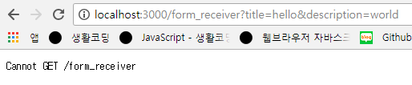

## GET, POST
- 서버와 웹브라우저가 상호작용하는 방법

#### GET 방식

- 웹브라우저에 주소를 입력해서 정보를 가져오는 방식
- 사용자가 서버에게 정보를 요청해 가져오는 것

## POST 방식
- 사용자의 정보를 서버로 전송하는 것
- ID, Password, 작성글 등을 서버로 전송


### 예제
- 전송하고자하는 정보는 form 태그로 묶어 전송함

#### GET 방식
form.pug
```
doctype html
html
  head
    meta(charset ='utf-8')
  body
    form(action='/form_receiver')
      p
        input(type='text' name='title')
      p
        textarea(name='description')
      p
        input(type='submit')
```
> views 디렉토리안에 템플릿엔진을 이용해 form 태그를 작성하고, 사용자가 입력한 각 정보의 이름을 알기위해 이름(name)을 부여함

```
form(action='/form_receiver')
```
> submit (제출)버튼을 누르면 정보를 form_receiver 서버로 전송하도록 지정

```
app.get('/form', function(req, res){
	res.render('form');
});
```
> 작성한 form 태그 랜더링


- title 폼에 hello \/ descriptiong 폼에 world 입력 후 제출


> url에 쿼리스트링방식으로 전달됨 (name=값&name=값)
```
app.get('/form_receiver', function(req, res){
	var title = req.query.title;
	var description = req.query.description;
	res.send(title+','+description);
});
```
> 웹페이지에 hello,world 가 출력됨

- form은 url을 생성해주는 작은 프로그램이라고 생각할 수 있음<br/>사용자가 값을 입력하면 웹페이지는 폼태그에따라 적당한 url을 자동으로 생성해 서버로 보내주는 역할을 함<br/>그리고 form_receiver는 사용자가 전달한 title과 description값을 저장할 수 있게됨

#### GET 방식
```
form(action='/form_receiver' method='post')
```
> 폼태그에 메소드를 post로 바꾸면 post 방식이 됨 메소드를 생략하면 기본적으로 get방식으로 작동함

- 아까와 같이 각각의 폼에 hello와 world를 입력 후 제출


> 주소에 쿼리스트링이 붙지않고 cannotpost /form_receiver이 출력됨

> 사용자가 전송한값은 전송이 되었으나 post방식이면 url을 통해서 전송하지않고 우리눈에 보이지않는 방식으로 전달하기때문에 url에 쿼리스트링이 붙지않음
