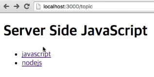

## 글목록 만들기
- 저장한 데이터를 목록으로 읽어오기 (출력)

1. get 라우팅
```
localhost:3000/topic
```
> 직접 해당 URL로 접속하면 GET 방식이므로 출력해줄것이 없음 (라우팅을 안한 상태)

2. [fs.readdir](https://nodejs.org/api/fs.html#fs_fs_readdir_path_options_callback) 사용
```
app.get('/topic', function(req, res){
	fs.readdir('data', function(err, files){
		if(err){
			console.log(err);
			res.status(500).send('Internal Server Error');
		}
		res.render('view', {topics:files});
	});	
});
```
- 코드해석
```
fs.readdir('data', function(err, files){...});
```
> 정보를 가져오고싶은 디렉토리의 경로, 정보를 가져왔을때 호출될 콜백함수
```
res.render('view', {topics:files})
```
> 템플릿 파일의 이름, 템플릿 파일 안으로 주입할 데이터를 객체안에 담아 주입 {변수:데이터}

3. 글목록 템플릿 작성
- [pug 홈페이지](https://pugjs.org) - Language Reference - [iteration](https://pugjs.org/language/iteration.html) 참고
> pug 문법의 반복문

views_file/view.pug
```
doctype html
html
	head
		meta(charset='utf-8')
	body
		h1 Sever Side JavaScript
		ul
			each topic in topics
				li
					a(href='/topic/'+topic)= topic
```
> 템플릿 문법에 맞는 반복문으로 글목록 리스트를 작성함
- 코드분석
```
each topic in topics
  li= topic
```
> topics의 정보들을 하나씩 topic 변수에 하나씩 담음 (pug 문법)
```
each topic in topics
  li
    a(href='/topic/'+topic)= topic
```
> 파일들을 하나씩 리스트로 만들어주고 해당 리스트를 링크로 연결해줌

4. 랜더링
```
app.get('/topic/new', function(req, res){
	res.render('view');
});
```
- 접속
```
localhost:3000/topic
```
- 결과
```
<li><a href="/topic/javascript">javascript</a></li>
<li><a href="/topic/nodejs">nodejs</a></li>
```
> data 폴더안에 javascript와 nodejs만 있는 상태<br/>웹페이지에 파일들이 리스트로 나열되고 각각 해당하는 링크가 걸림 (이동은하지만 아직 출력하지는 않음)
<br/>
