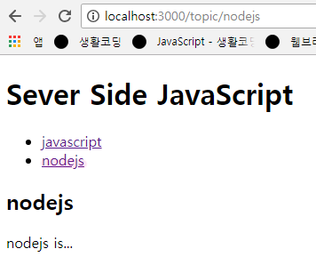

## 본문읽기
- 링크를 타고 들어오면 링크에 해당되는 글을 화면에 출력해주기

1. get 라우트
- 링크를 타고 들어왔다는건 GET방식이므로 GET방식으로 라우트를 해줌
- 링크마다 url이 바뀌므로 바뀔 수 있는 url 정보인 콜론( : )방법을 이용
```
app.get('/topic/:id', function(req, res){
  var id = req.params.id;
  res.send(id);
});
```
> 링크를 누를때마다 해당하는 id값이 웹페이지에 출력됨

2. 해당 데이터 가져오기
- 파일을 읽어올때 사용하는 fs.readFile 이용
```
fs.readFile('data/'+id, 'utf8', function(err, data){
  if(err){
    console.log(err);
    res.status(500).send('Internal Server Error');
  }
  res.render(data)
});
```
> 링크를 클릭하면 해당 링크에서 알맞는 내용(data)을 웹페이지에 출력함

- 코드분석
```
fs.readFile('data/'+id, 'utf8', function(err, data){...});
```
> 경로, utf8, 콜백

3. 현재창에서 데이터 출력하기
view.pug
```
doctype html
html
  head
    meta(charset='utf-8')
  body
    h1 Sever Side JavaScript
    ul
    each topic in topics
      li
        a(href='/topic/'+topic)= topic
    article
      h2= title
      = description
```
> 리스트목록 밑에 데이터를 출력시킴

app_file.js
```
app.get('/topic/:id', function(req, res){
  var id = req.params.id;
  fs.readdir('data', function(err, files){
    if(err){
      console.log(err);
      res.status(500).send('Internal Server Error');
    }
    fs.readFile('data/'+id, 'utf8', function(err, data){
      if(err){
        console.log(err);
        res.status(500).send('Internal Server Error');
      }
      res.render('view', {topics:files, title:id, description:data});
    });
  });	
});
```
- 코드분석
```
app.get('/topic/:id', function(req, res){...});
```
> 사용자가 /topic에 특정한 파라미터(:id)를 가지고 접속
```
fs.readdir('data', function(err, files){...});
```
> readdir 통해서 data 디렉토리의 파일들의 목록을 가져와 files 에 담음
```
fs.readFile('data/'+id, 'utf8', function(err, data){...});
```
> readdir이 성공하면 readFile을 통해 해당 id 값에 해당하는 데이터를 가져와 안에 내용을 data에 담음
```
res.render('view', {topics:files, title:id, description:data});
```
> topics 변수 안에는 files, title 변수 안에는 id, description 변수 안에는 data 를 각각 담은 객체를 view.pug 안에 전달

- 결과


> 링크를 누를때마다 각각 해당하는 파일의 제목과 본문을 리스트목록 아래에 출력함


#### 번외
- fs.readdir 을 위에서 한번 작성했는데 다시 파라미터로 접속할때의 코드에도 작성한 이유
```
app.get('/topic/new', function(req, res){
	res.render('new');
});

app.get('/topic', function(req, res){
	fs.readdir('data', function(err, files){  // (1)
		if(err){
			console.log(err);
			res.status(500).send('Internal Server Error');
		}
		res.render('view', {topics:files});
	});	
});

app.get('/topic/:id', function(req, res){
	var id = req.params.id;
	fs.readdir('data', function(err, files){  // (2)
		if(err){
			console.log(err);
			res.status(500).send('Internal Server Error');
		}
		fs.readFile('data/'+id, 'utf8', function(err, data){
			if(err){
				console.log(err);
				res.status(500).send('Internal Server Error');
			}
			res.render('view', {topics:files, title:id, description:data});
		});
	});	
});
```
> view 안에 topics는 /topic 로 접근할때도 필요하고 /topic/:id 로 접근할때도 필요하기때문에 두번 써줘야함
