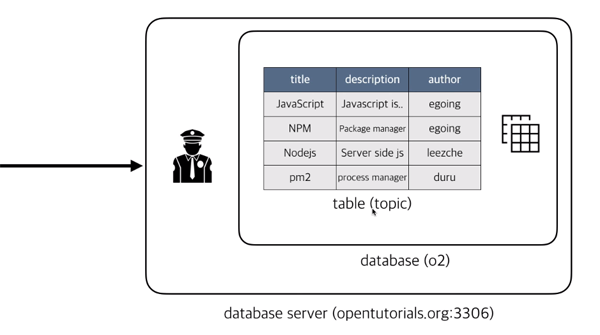

## MySQL
- 3대 관계형 데이터베이스에 속하는 데이터베이스 시스템
- 웹이 등장하면서 큰 규모의 사이트(관공서 등)와 다른 작은 규모의 사이트(개인, 기업)들이 등장함 그러면서 신뢰성과 같은것들에 대한 부담이 낮아지면서 기본의 부담스러운 시스템이었던 데이터베이스(Oracle)가 아닌 무료 오픈소스에 성능도 괜찮은 MySQL이 성공하게 됨
- AMP(Apache, MySQL, PHP) : Apache, PHP, MySQL로 묶여 많은 웹에플리케이션이 만들어짐
- MariaDB 처럼 Amazon Aurora도 MySQL과 호환되도록 설계가 되고 이러한 현상들이 지속되고있다는 사실은 MySQL의 시대가 열렸으며 오늘날 가장 뜨거운 데이터베이스는 MySQL이라고 말할 수 있게됨
  - MariaDB : MySQL과 호환되는 DB (MySQL 개발자가 만듬)

## MySQL 구조
  
- 테이블(표) : 기본적인 단위로 실제 정보가 저장되는 장소
  - 행(row) : 수평 그룹 (한줄), Record라고도 함 \/ 같은 데이터의 그룹
  - 열(column) : 수직 그룹 \/ title 그룹, description 그룹  ...
- 정보가 추가됨에 따라 다양한 테이블들이 하나앱 안에 사용이 됨
- 연관된 테이블들을 database로 그룹핑해 이름(o2)을 정의함 이 그룹은 연관된 테이블들의 일종의 디렉토리, 분류, 카테고리가 됨
- 하나의 앱은 하나의 데이터베이스를 갖는데 이들을 그룹핑하면 이 그룹은 데이터들이 위치하고있는 컴퓨터를 가르키는 서버가 됨
- 이 서버는 3306 포트를 바라보는 서버가 됨
- 이 데이터에 접속하게되면 인증을해야 데이터베이스에 접근이 가능함
- 어떤 그룹을 사용하겠다 정해주면 그 안에 포함된 해당 테이블들을 제어가능해짐
