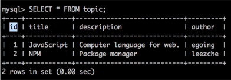

## 데이터베이스에 접속
- 인증
```
-u(아이디) -h(호스트네임) -P(포트) -p(패스워드)
```
> 호스트네임과 포트는 생략가능 (기본적으로 localhost와 3306포트로 접근해줌)


## 데이터베이스 생성
- 폴더 생성과 같은 의미
```
CREATE DATABASE o2 CHARACTER SET utf8 COLLATE utf8_general_ci;
```
> o2라는 이름의 DB를 생성함


## 데이터베이스 보기
```
show databases;
```

- 결과


> 데이터베이스는 처리속도가 중요하기때문에 항상 처리속도를 출력함 속도가 너무느리면 튜닝을 해주어야함


## 데이터베이스 선택
```
use o2;
```
> o2 DB를 이용하겠음을 알려줌


## 테이블 생성
```
CREATE TABLE `topic` (
`id` int(11) NOT NULL AUTO_INCREMENT,
  `title` varchar(100) NOT NULL,
  `description` text NOT NULL,
  `author` varchar(30) NOT NULL,
  PRIMARY KEY (id)
) ENGINE=InnoDB DEFAULT CHARSET=utf8;
```
> o2 DB안에 topic이라는 이름의 테이블을 생성함

- `id : 행의 식별자`, 명시적으로 정의하지않으면 `AUTO_INCREMENT`에 의해 숫자가 자동적으로 부여됨


## 테이블 확인
```
show tables;
```

- 결과

<br/>


## 데이터 삽입
```
INSERT INTO topic (title, description, author) VALUES('JavaScript','Computer language for web.', 'egoing');
INSERT INTO topic (description, title, author) VALUES('Package manager', 'NPM', 'leezche');
```
> topic 테이블안에 정보를 추가함<br/>순서는 상관없지만 뒤에 정보(values)값은 앞에 순서를 맞춰야함


## 데이터 조회
```
SELECT * FROM topic
```
> topic 테이블에 저장된 모든 행을 가져옴

- `* : 모든 정보`

- 결과


> id가 자동으로 부여된 사실을 확인할 수 있음

## 데이터 조회2
- 식별자가 중요한 이유는 특정한 하나의 행을 선택할 수 있기 때문
```
SELECT * FROM topic WHERE id=2;
```
> topic 테이블의 id가 2인 행만 가져옴

- 결과


