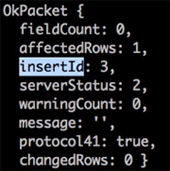
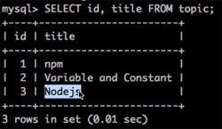

## Node-mysql
- javascript를 이용해 mysql을 제어할때 사용
- 서버는 정보를 응답하고 클라이언트는 정보를 요청하며 서버와 클라이언트는 상대적이다.<br/>우리 앱은 MySQL에게 정보를 요청하는 입장에서 클라이언트지만, 웹브라우저로 접속한 사용자에게는 서버가 된다.


## Node-mysql 접속
- [Node-mysql 메뉴얼](https://github.com/mysqljs/mysql) 참고
1. 설치
```
npm install node-mysql --save
```

2. 가져오기
database_mysql.js
```
var mysql = require('mysql');
var conn = mysql.createConnection({
  host     : 'localhost',    // mysql 서버의 위치
  user     : 'root',         // 접속 아이디 
  password : '****',         // 비밀번호
  database : 'o2'            // db 이름
});
```

3. 연결 (커넥트)
```
conn.connect();
```

4. 코드작성
- 기본코드
```
conn.query('SELECT 1 + 1 AS solution', function (error, results, fields) {
  if (error) throw error;
  console.log('The solution is: ', results[0].solution);
});
```
- 변경
```
var sql = 'SELECT * FROM topic';
conn.query(sql, function(err, rows, fields){
  if(err){
    console.log(err);
  } else {
    console.log('rows', rows);
    console.log('fields', fields);
  }
});
```
> row는 배열로 출력됨
- 코드분석
```
conn.query(sql, function(err, rows, fields){...});
```
> query는 변수 conn이 가르키는 접속에 해당하는 서버를 대상으로 query(지리)를 보냄<br/>첫번째 인자로 sql 문서가 전달되고 서버가 받아서 작업을 처리한 후 처리가 끝나면 mysql 모듈이 콜백 function을 호출함

- `fields : column 목록`

5. 연결끊기
```
conn.end();
```
> 작업이 끝나면 커넥션을 끊어 접속을 끊음 (ctrl+c가 자동으로 되는것과 같음)

- 실제로는 이렇게 직접 호스트의 비밀번호를 작성하면 안되고 별도의 파일로 빼서 다른사람과 공유하지않는 코드를 관리해야함


## SELECT & INSERT
#### SELECT
```
var sql = 'SELECT * FROM topic';
conn.query(sql, function(err, rows, fields){
  if(err){
    console.log(err);
  } else {
    for(var i=0; i<rows.length; i++){
      console.log(rows[i].title);
    }
  }
});
```
- 결과
```
Javascript
npm
```
> 행의 title들이 출력됨

#### INSERT
```
var sql = 'INSERT INTO topic (title, description, author) VALUES("Nodejs", "Server side javascript", "egoing")'; 
conn.query(sql, function(err, rows, fields){
  if(err){
    console.log(err);
  } else {
    console.log(rows);
  }
});
```
- 결과

<br/>
> affectedRows를 통해 하나의 행에 영향을 준것과 inserID를 통해 3번째 id에 해당값을 추가했음을 알 수 있음
- `affectedRows를 통해 처리의 성공유무를 판단할 수 있음`

- 조회
```
SELECT id, title FROM topic;
```
> id와 title만 조회함
- 결과


> Nodejs 값이 추가됨

```
var sql = 'INSERT INTO topic (title, description, author) VALUES("Express", "Web framework", "duru")'; 
conn.query(sql, function(err, rows, fields){
  if(err){
    console.log(err);
  } else {
    console.log(rows.insertId);  // 4
  }
});
```
> Express가 추가되면서 inserId를 통해 추가된 데이터의 id의 값을 알아낼 수 있음
- `insertId : 고유한 식별자를 알아낼수있는 식별자`

```
var sql = 'INSERT INTO topic (title, description, author) VALUES(?, ?, ?)';
var params = ['Supervisor', 'Watcher', 'graphittie']; 
conn.query(sql, params, function(err, rows, fields){
  if(err){
    console.log(err);
  } else {
    console.log(rows.inserId);
  }
});
```
> 치환자 순서에따라 실제값들을 배열로 생성한 후 그것을 query문의 2번째 인자값으로 전달하면 내부적으로 node-mysql이 치환자를 실제값으로 치환시켜서 실행시킴 (보안실현)

> 조회하면 배열의 값인 Supervisor 구문들이 데이터로 추가됨

- `? : 치환자`
- sql 문은 프로그래밍적으로 생성해야 의미가 있음


## UPDATE & DELETE
#### UPDATE
```
var sql = 'UPDATE topic SET title=?, author=? WHERE id=?';
var params = ['NPM', 'leechze', 1]; 
conn.query(sql, params, function(err, rows, fields){
  if(err){
    console.log(err);
  } else {
    console.log(rows);
  }
});
```
> 1번의 데이터가 위에 값으로 변경됨

#### DELETE
```
var sql = 'DELETE FROM topic WHERE id=?';
var params = [1]; 
conn.query(sql, params, function(err, rows, fields){
  if(err){
    console.log(err);
  } else {
    console.log(rows);
  }
});
```
> id가 1번인 데이터 행이 삭제됨
