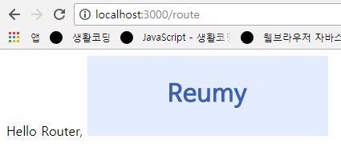

## 동적인 정보, 정적인 정보
- 동적인 정보 : 프로그래밍적으로 만들어진 정보
- 정적인 정보 : 사람이 한번 작성해 만들어진것과 같이 언제나 똑같이 보이는 정보


## 정적파일 서비스하기
- 서버 컴퓨터에 있는 정적인 데이터를 클라이언트 컴퓨터에서 확인할 수 있도록 코드를 추가함
1. 정적인 파일이 위치할 디렉토리를 지정하는 코드를 입력함
```
app.use(express.static('디렉토리명'));
```
> public 디렉토리를 정적인 파일들이 위치한 디렉토리로 지정함

- 디렉토리명은 관습적으로 public을 많이 사용

2. 해당 디렉토리에 서비스할 정적인 파일을 담음

- 코드작성
```
app.use(express.static('public'));

app.get('/route', function(req, res){
	res.send('Hello Router, ')
});
```
> app.js 파일에 위에 코드를 추가함

- 실행
```
node app.js
```
- 접속
```
localhost:3000/route
```
- 결과

<br/>

- Network


> 웹페이지에서 로드하는 내용을 볼 수있음


### 경로
- 왜 \/public\/route 가 아닐까?
```
app.get('/route', function(req, res){
  res.send('Hello Router, ')
});
```
> 경로가 지정(public)되면 정적인 파일에 접근할 때 정확한 경로없이도 루트경로(/)로 인식할 수 있음
```
localhost:3000/reumy.jpg
```
> 실행O
```
localhost:3000/test.text  // Hello static
```
> 실행O

- 둘다 public 안에있는 정적인 파일들을 성공적으로 출력해줌
